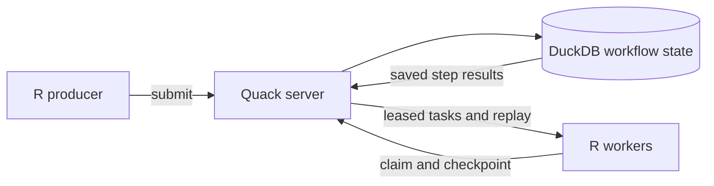

<!-- README.md is generated from README.Rmd. Edit README.Rmd. -->

```{r setup, include=FALSE}
knitr::opts_chunk$set(eval = TRUE, cache = FALSE, collapse = TRUE, comment = "#>", error = FALSE)
library(CanardAbsurd)
```

# CanardAbsurd

[](https://github.com/RGenomicsETL/CanardAbsurd/actions/workflows/pkgdown.yaml)
[](https://rgenomicsetl.r-universe.dev/CanardAbsurd)

**Durable R workflows. DuckDB owns the state; Quack serves it.**

One R package hosts the database and supplies thin R clients. Workers pull
leased tasks, run ordinary R functions, and save named step results for replay.

## Lineage: Absurd, expressed through R

[Absurd](https://github.com/earendil-works/absurd), from
[Earendil Works](https://github.com/earendil-works), establishes the central idea: durable
execution can live in a database, with ordinary functions replaying named
checkpoints after interruption. CanardAbsurd adapts that model to **R handlers,
DuckDB state, and Quack remote SQL**.

The shared lineage is the execution model, not PostgreSQL schema or SDK wire
compatibility. CanardAbsurd owns its SQL state machine and R API. External effects
still require application-level idempotency.



[Get started](https://rgenomicsetl.github.io/CanardAbsurd/articles/getting-started.html)
· [Quack deployment](https://rgenomicsetl.github.io/CanardAbsurd/articles/quack-server.html)
· [API reference](https://rgenomicsetl.github.io/CanardAbsurd/reference/index.html)

## A real server, client, and resumed workflow

This example starts a temporary Quack server and connects through a separate
DuckDB client. It executes while this README is rendered. Quack must already be
installed for the R DuckDB runtime; package loading does not download extensions.

```{r quack-workflow}
local({
  path <- tempfile(fileext = ".duckdb")
  on.exit(unlink(c(path, paste0(path, ".wal"))), add = TRUE)
  uri <- sprintf("quack:127.0.0.1:%d", parallelly::freePort())

  server <- ca_serve(path, uri, token = "readme-local-only")
  on.exit(ca_close(server), add = TRUE, after = FALSE)
  client <- ca_connect(uri, token = "readme-local-only")
  on.exit(ca_close(client), add = TRUE, after = FALSE)

  id <- ca_spawn(client, "calculate", list(x = 21), id = "example-001")
  step_calls <- 0L
  handlers <- list(calculate = function(input, ctx) {
    value <- ca_step(ctx, "double", function() {
      step_calls <<- step_calls + 1L
      input$x * 2
    })
    ca_sleep(ctx, "yield", seconds = 0)
    value
  })

  ca_work(client, handlers, max_tasks = 2)
  task <- ca_inspect(client, id)
  stopifnot(task$state == "completed", task$attempt == 2L,
            task$result == 42, step_calls == 1L)

  list(
    runtime = ca_runtime(client),
    workflow = data.frame(
      state = task$state, attempts = task$attempt,
      step_executions = step_calls, result = task$result
    )
  )
})
```

The first attempt saves `double` and suspends. The second attempt replays that
result, passes the saved sleep, and completes. The callback runs once. A
zero-second sleep makes the suspension visible without waiting during the build.

For development without a server, `ca_open()` provides the same API against an
embedded database. For deployment, one long-lived R process owns `ca_serve()`;
independent worker processes use `ca_connect()` and `ca_work()`.

## Install

The package is published through the
[RGenomicsETL r-universe](https://rgenomicsetl.r-universe.dev/CanardAbsurd).
A source checkout can also be installed with `R CMD INSTALL .`.

The workflow SQL requires DuckDB's JSON extension; remote access also requires
Quack. Before running the examples, `make quack` explicitly installs both for the
R DuckDB runtime and creates `~/.duckdb` so they persist across R processes.
The package itself never downloads extensions.

## The recovery contract

- **Atomic claims and fenced writes.** A worker must hold the current unexpired
  lease token to checkpoint, heartbeat, complete, fail, or suspend a task.
- **Replay, not exactly-once external effects.** A crash after an API call but
  before its checkpoint can repeat that call. Use business-level idempotency keys.
- **Explicit heartbeats.** Step boundaries renew the lease. Long operations must
  call `ca_heartbeat(ctx)` before expiry; no R background thread is used.
- **Stable steps.** Names and JSON result shapes are persistent interfaces.
  Give loop steps explicit indexed names and keep resumable handlers compatible.
- **One database owner.** Other processes connect through Quack rather than
  opening the writable database file. Connection handles own dedicated,
  process-local connections; do not wrap operations in external transactions.

See [Durability and recovery](https://rgenomicsetl.github.io/CanardAbsurd/articles/durability.html)
for failure budgets, cancellation, JSON semantics, and operational limits.

## Scope and development

This experimental release provides tasks, priorities, checkpoint replay, fixed
retry delays, durable sleep, cancellation, and inspection. Events, cron,
automatic retention, task history tables, and schema migrations are not provided.
Operators must manage database growth and protect Quack endpoints with
appropriate authentication, network restrictions, and TLS.

`make docs` evaluates the README, renders a litedown landing page, and builds
pkgdown guides and reference pages. `make check` builds and
checks the source package, including its evaluated vignettes. `make test` runs
`tinytest`, real multi-process Quack tests, and `s7contract` laws. The Quack tests
cover competing claims, worker and database-host crashes, and stale completions.

Licensed under [GPL-2-or-later](https://github.com/RGenomicsETL/CanardAbsurd/blob/main/LICENSE.md).
