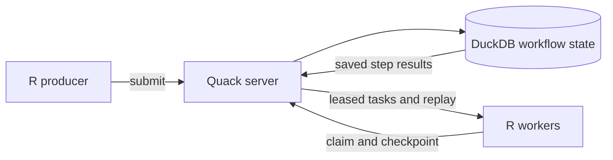

<!-- README.md is generated from README.Rmd. Edit README.Rmd. -->

# CanardAbsurd 

[](https://github.com/RGenomicsETL/CanardAbsurd/actions/workflows/pkgdown.yaml)
[](https://rgenomicsetl.r-universe.dev/CanardAbsurd)

**Durable R workflows with a single DuckDB owner. Quack serves it.**

Use CanardAbsurd when R work must survive an interrupted worker, pause until a
later time, and resume without redoing completed named steps. Workers claim
leased tasks, run R functions, and save each step result in DuckDB.

A Quack server is mandatory for a shared workflow database. One server process
owns the writable DuckDB file; producers and workers send SQL through Quack
rather than opening that file themselves. This avoids direct multi-process
DuckDB/WAL contention and the resulting locking errors. External effects still
need application-level idempotency.

## Lineage: Absurd, expressed through R

[Absurd](https://github.com/earendil-works/absurd), from
[Earendil Works](https://github.com/earendil-works), uses database-backed
checkpoint replay: functions resume from named checkpoints after interruption.
CanardAbsurd adapts that model to **R handlers,
DuckDB state, and Quack remote SQL**.

The shared lineage is the execution model, not PostgreSQL schema or SDK wire
compatibility. CanardAbsurd owns its SQL state machine and R API.



[Get started](https://rgenomicsetl.github.io/CanardAbsurd/articles/getting-started.html)
· [Quack deployment](https://rgenomicsetl.github.io/CanardAbsurd/articles/quack-server.html)
· [API reference](https://rgenomicsetl.github.io/CanardAbsurd/reference/index.html)

## Install

Install with `install.packages("CanardAbsurd", repos =
"https://rgenomicsetl.r-universe.dev")`. A shared workflow database also
requires explicitly installed DuckDB JSON and Quack extensions; follow the
[Quack runtime setup instructions](https://rgenomicsetl.github.io/CanardAbsurd/articles/quack-server.html#install-the-runtime).

## Start a server and connect a client

This walkthrough runs the server and client in one R process, but they are
independent DuckDB connections communicating through a Quack endpoint. Deploy the server in its own long-lived process and connect producers
and workers from separate R processes as described in the
[Quack deployment guide](https://rgenomicsetl.github.io/CanardAbsurd/articles/quack-server.html#deploy-across-processes).

Choose a temporary database file, an available localhost port, and a shared
authentication token for this example. Register cleanup as resources are created
so it also runs if an example fails.

```{r server-address}
library(CanardAbsurd)
path <- tempfile(fileext = ".duckdb")
withr::defer(unlink(c(path, paste0(path, ".wal"))))
uri <- sprintf("quack:127.0.0.1:%d", parallelly::freePort())
token <- "readme-local-only"
```

Start the server. Its R process owns the database and must remain running while
clients use it.

```{r start-server}
server <- ca_serve(path, uri, token = token)
withr::defer(ca_close(server))
```

Connect a client and ask the server for its runtime versions. The client uses
Quack rather than opening the database file.

```{r connect-client}
client <- ca_connect(uri, token = token)
withr::defer(ca_close(client))
ca_runtime(client)
```

## Submit, checkpoint, and resume

A handler takes its input and a task context. `ca_step()` saves the callback's
result; `ca_sleep()` saves a pause and releases the claim. The zero-second pause
below makes the task immediately eligible for another worker.

```{r define-workflow}
calculate <- function(input, ctx) {
  value <- ca_step(ctx, "double", function() {
    input$x * 2
  })
  ca_sleep(ctx, "pause", seconds = 0)
  value
}
```

Submit the input to the `reports` queue with a stable task ID.

```{r submit-workflow}
id <- ca_spawn(client, "calculate", list(x = 21),
               id = "report-001", queue = "reports")
id
```

Repeating the same submission returns its task ID instead of creating another
task.

```{r repeat-submission}
ca_spawn(client, "calculate", list(x = 21), id = id, queue = "reports")
```

Claim and execute one attempt. It saves `double`, reaches the pause, and returns
with the task ready to be resumed.

```{r run-first-attempt}
claim <- ca_claim(client, queue = "reports")
outcome <- ca_run(claim, calculate)
outcome[c("attempt", "status", "state")]
```

Both named checkpoints are now stored on the server.

```{r inspect-checkpoints}
names(ca_inspect(client, id)$checkpoints)
```

Close the client and reconnect. The saved work belongs to the database, not to
the client connection.

```{r reconnect-client}
ca_close(client)
client <- ca_connect(uri, token = token)
```

Let `ca_work()` claim the next attempt using its named handler list. `double`
replays its saved value, the saved pause returns, and the task completes.

```{r resume-workflow}
ca_work(client, list(calculate = calculate), queue = "reports", max_tasks = 1)
ca_inspect(client, id)[c("state", "attempt", "failures", "result")]
```

## Use a business key for external effects

A file write can finish before its step result is checkpointed. Retrying that
step will perform the write again. Use a business key for the filename so the
retry replaces the same receipt instead of producing another one.

```{r receipt-directory}
receipt_dir <- tempfile("receipts-")
dir.create(receipt_dir)
withr::defer(unlink(receipt_dir, recursive = TRUE))
```

To expose the write/checkpoint gap, this callback raises a classed error after
its first file write.

```{r define-publication}
publish <- function(input, ctx) {
  ca_step(ctx, "receipt", function() {
    receipt <- file.path(receipt_dir, paste0(input$order_id, ".txt"))
    writeLines(input$text, receipt)
    if (ctx@attempt == 1L) {
      stop(errorCondition("Stopped before checkpoint", class = "publication_error"))
    }
    input$order_id
  })
}
```

Give the task a budget of two failures. Run one attempt with no delay before it
can be claimed again. `ca_run()` returns the original condition and the persisted
task state: a failed attempt can leave a task ready for retry.

```{r failed-attempt}
receipt_id <- ca_spawn(client, "publish", list(order_id = "order-42", text = "total=42"),
                       id = "receipt-001", queue = "receipts", max_failures = 2)
claim <- ca_claim(client, queue = "receipts")
outcome <- ca_run(claim, publish, failure_delay = 0)
outcome[c("status", "state", "error")]
```

The file exists, but the step has no saved checkpoint.

```{r inspect-uncheckpointed-effect}
readLines(file.path(receipt_dir, "order-42.txt"))
names(ca_inspect(client, receipt_id)$checkpoints)
```

Retry with a worker. `on_result` receives the attempt's outcome after persistence
and lets the caller choose how to report it.

```{r retry-publication}
ca_work(client, list(publish = publish), queue = "receipts", max_tasks = 1,
        on_result = function(outcome) {
          print(outcome[c("attempt", "status", "result")])
        })
```

The retry writes the same file. There is one receipt and one recorded handler
failure. For an external API, use an equivalent idempotency key enforced by
that service.

```{r inspect-retried-effect}
list(files = list.files(receipt_dir),
     text = readLines(file.path(receipt_dir, "order-42.txt")),
     failures = ca_inspect(client, receipt_id)$failures)
```

## Name loop steps and choose SQL retries

Use each item's stable ID in its checkpoint name. A resumed loop can then find
the saved result for that item.

```{r define-batch}
double_items <- function(input, ctx) {
  lapply(input$items, function(item) {
    ca_step(ctx, paste0("item-", item$id), function() item$x * 2)
  })
}
```

Submit a batch with two identified items.

```{r submit-batch}
batch_id <- ca_spawn(client, "double_items",
                     list(items = list(list(id = "a", x = 2), list(id = "b", x = 3))),
                     id = "batch-001", queue = "batch")
```

For competing workers, choose SQL retry delays at the call site. This handler
allows up to three retries of a recognized conflict. The restart repeats only
the failed SQL statement, not the R handler or its external effects. Returning
without invoking it lets the conflict propagate.

```{r caller-owned-retries}
delays <- c(0.01, 0.05, 0.1)
withCallingHandlers(
  ca_work(client, list(double_items = double_items), queue = "batch", max_tasks = 1),
  canard_retryable = function(conflict) {
    if (conflict$attempts <= length(delays)) {
      Sys.sleep(delays[[conflict$attempts]])
      invokeRestart("canard_retry")
    }
  }
)
```

Inspect the batch's results and checkpoint names.

```{r inspect-batch}
batch <- ca_inspect(client, batch_id)
batch$result
names(batch$checkpoints)
```

Transport failures propagate without a retry restart. Released drivers require
an error-message compatibility adapter for conflict detection; its conditions
carry `message_based = TRUE`. See the
[documented limitation](https://rgenomicsetl.github.io/CanardAbsurd/articles/durability.html#error-metadata-compatibility)
when selecting a DuckDB/Quack version.

## Renew a lease and cancel a task

A claimed task can renew its lease with `ca_heartbeat()`. Cancellation still
revokes its right to update task state, even while that lease would otherwise be live.

```{r cancel-task}
cancel_id <- ca_spawn(client, "calculate", list(x = 99),
                     id = "cancel-001", queue = "cancel")
claim <- ca_claim(client, queue = "cancel")
ca_heartbeat(claim, seconds = 60)
ca_cancel(client, cancel_id)
```

A completion using the cancelled claim raises `canard_lease_lost`. Catch that
specific condition to handle the rejected write.

```{r rejected-completion}
tryCatch(
  ca_complete(claim, 198),
  canard_lease_lost = function(error) conditionMessage(error)
)
ca_inspect(client, cancel_id)$state
```

## Close the connections

Close the client before stopping the server.

```{r close-connections}
ca_close(client)
ca_close(server)
```

`ca_open()` is for a single-process workflow, such as an offline test or script;
do not share its database file with other R processes. For any shared workflow
database, keep the Quack server in one long-lived R process and run independent
producers and workers with `ca_connect()` and `ca_work()`.

See [Durability and recovery](https://rgenomicsetl.github.io/CanardAbsurd/articles/durability.html)
for failure budgets, cancellation, JSON semantics, and operational limits.

## Scope and development

This experimental release provides tasks, priorities, checkpoint replay,
failure retry scheduling, durable sleep, cancellation, and inspection. Events, cron,
automatic retention, task history tables, and schema migrations are not provided.
Operators must manage database growth and protect Quack endpoints with
appropriate authentication, network restrictions, and TLS.

`make docs` evaluates the README, renders a litedown landing page, and builds
pkgdown guides and reference pages. `make check` builds and
checks the source package, including its evaluated vignettes. `make test` runs
`tinytest`, multi-process Quack tests, and `s7contract` laws. The Quack tests
cover competing claims, worker and database-host crashes, and stale completions.

Licensed under [GPL-2-or-later](https://github.com/RGenomicsETL/CanardAbsurd/blob/main/LICENSE.md).
