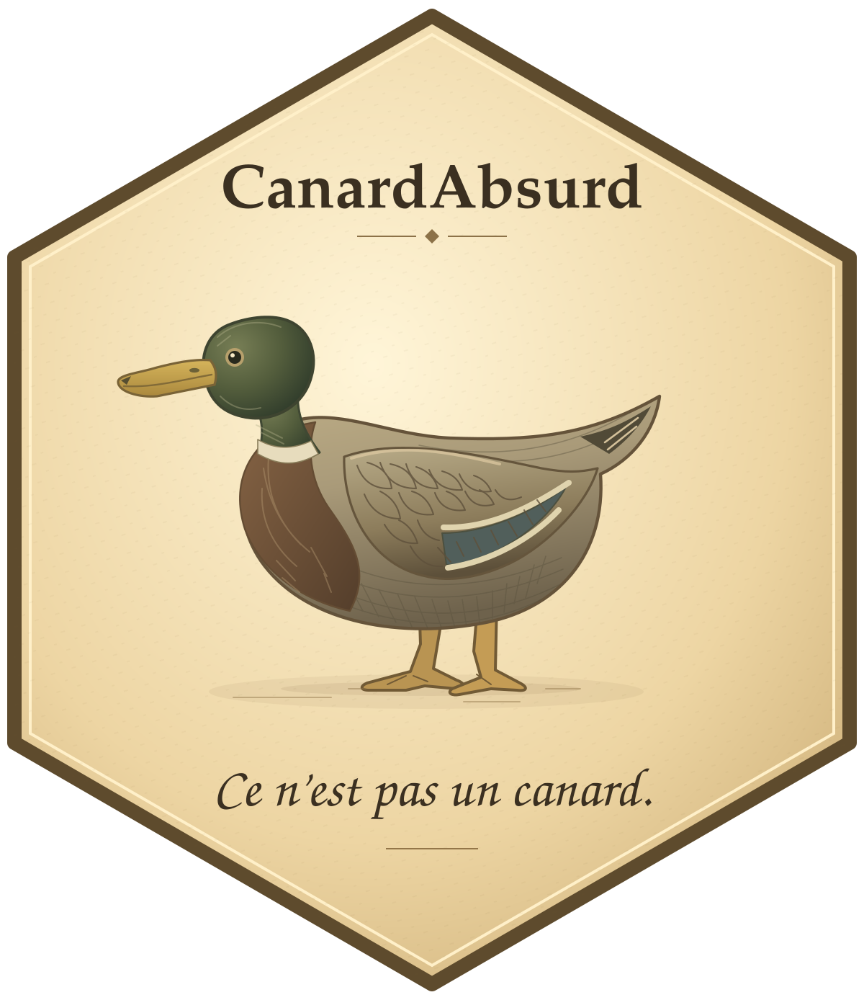
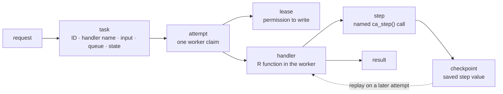

<!-- README.md is generated from README.Rmd. Edit README.Rmd. -->

# CanardAbsurd 

[](https://github.com/RGenomicsETL/CanardAbsurd/actions/workflows/pkgdown.yaml)
[](https://rgenomicsetl.r-universe.dev/CanardAbsurd)

CanardAbsurd keeps costly R work alive after the process that requested it has
returned. An application or API submits a request, a worker pulls it when
capacity is available, and named completed stages are replayed when a later
worker resumes the work.

It adapts the checkpoint-and-replay execution model from
[Absurd](https://github.com/earendil-works/absurd) to R, DuckDB, and Quack.
The R API, SQL state machine, storage layout, and transport are independent.

## Is this the right tool?

Use CanardAbsurd when an input should start expensive work that may outlive its
request process: an upload, a refresh, a report request, or an API call. It is
useful when a replacement worker should continue from saved stages instead of
starting the whole handler again.

It is not a dependency-graph scheduler, an artifact store, a notification
service, or an exactly-once external-effect system. The application decides
when work is requested and what its result means. `targets` can decide graph
expansion, cache validity, and invalidation; CanardAbsurd can run durable
requests that a controller submits.

## The mental model



Only the task, checkpoint, and result are durable. A handler lives in a worker
process. Each claim starts an attempt and grants a lease; `ca_step()` connects
a named step to its saved checkpoint. A later attempt replays that checkpoint
instead of rerunning its callback. Terminal tasks are `completed`, `failed`, or
`cancelled`.

## Install

```r
install.packages("CanardAbsurd", repos = "https://rgenomicsetl.r-universe.dev")
```

For one R process, use `ca_open()`. For a database shared by producers and
workers, explicitly install the matching Quack extension and run one
long-lived `ca_serve()` process. The [Quack server guide](https://rgenomicsetl.github.io/CanardAbsurd/articles/quack-server.html)
shows the setup.

## Run a small workflow

This local example has one request, two durable stages, and one worker. It is a
good way to learn the handler contract; it is not a shared deployment.

```{r small-workflow}
library(CanardAbsurd)

db <- ca_open()

total <- function(input, task) {
  subtotal <- ca_step(task, "subtotal", function() sum(input$amounts))
  ca_step(task, "total", function() subtotal * (1 + input$tax))
}

id <- ca_spawn(
  db,
  "total",
  list(amounts = c(20, 10), tax = 0.2),
  id = "invoice-42"
)
ca_work(db, list(total = total), max_tasks = 1)

task <- ca_inspect(db, id)
list(state = task$state, attempts = task$attempt,
     checkpoints = names(task$checkpoints), result = task$result)

ca_close(db)
```

If the worker fails after saving `subtotal`, another attempt calls the same
handler and `ca_step(task, "subtotal", ...)` returns the saved value without
running that callback again. A step callback that finishes but fails before its
value is saved can run again.

## Choose the database owner

| Situation | Use |
|---|---|
| One script or one R process | `ca_open()` |
| Producers and workers in separate processes | One `ca_serve()` process and `ca_connect()` clients |

For shared work, the server is the only process that opens the DuckDB file.
Producers and workers use Quack connections to that server. Workers run R
handlers in their own processes; the server only executes SQL.

## Make external work repeatable

A saved step is durable only after its database write succeeds. If a worker
writes a file, calls an API, or launches a tool and then exits before that
write, the next attempt can repeat the action. Use a business-level idempotency
key where the external system enforces it.

A lease rejects writes from an old worker after another worker has reclaimed the
task. It does not terminate a process that is already running. Long callbacks
must call `ca_heartbeat()` before their lease expires; `ca_step()` and
`ca_sleep()` renew the lease when they save state.

## Use it with `targets`

`targets` and CanardAbsurd solve different problems:

| `targets` owns | CanardAbsurd owns |
|---|---|
| target graph, branching, cache validity, invalidation, and controller decisions | request state, worker leases, checkpoint replay, retryable task attempts, and cancellation fences |

A controller can submit a stable application request ID, let independent
CanardAbsurd workers run it, then inspect the terminal task. The request ID
must describe the requested execution, not merely an input value: a controller
may intentionally request another execution with unchanged inputs. There is no
`targets` backend in this package.

## Values and next steps

Inputs, results, and checkpoints use native DuckDB values with R type
descriptors. Supported vectors, lists, data frames, dates, timestamps, factors,
raw vectors, and `integer64` values round trip with their documented mappings.
For other R objects, serialize explicitly to a raw vector and store it as a
BLOB; CanardAbsurd never selects a serializer automatically.

Read the guide that matches the next question:

- [Getting started](https://rgenomicsetl.github.io/CanardAbsurd/articles/getting-started.html): handler, attempt, step, and worker behavior.
- [A Quack server and R workers](https://rgenomicsetl.github.io/CanardAbsurd/articles/quack-server.html): one writable DuckDB owner and separate processes.
- [Durability and recovery](https://rgenomicsetl.github.io/CanardAbsurd/articles/durability.html): leases, retries, failures, sleeps, cancellation, and external effects.
- [Native values and DuckDB R compatibility](https://rgenomicsetl.github.io/CanardAbsurd/articles/native-values.html): mappings and driver limitations.
- [Serialized R values](https://rgenomicsetl.github.io/CanardAbsurd/articles/serialized-values.html): explicit base R, qs2, and Sakura BLOB workflows.
