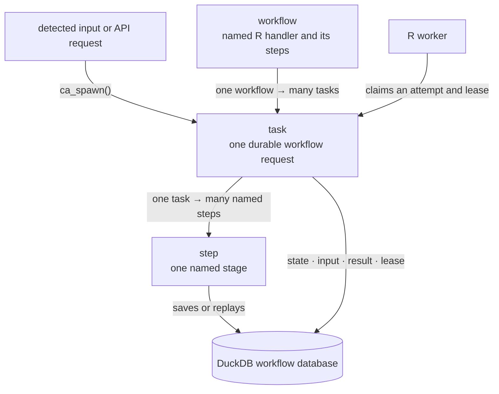
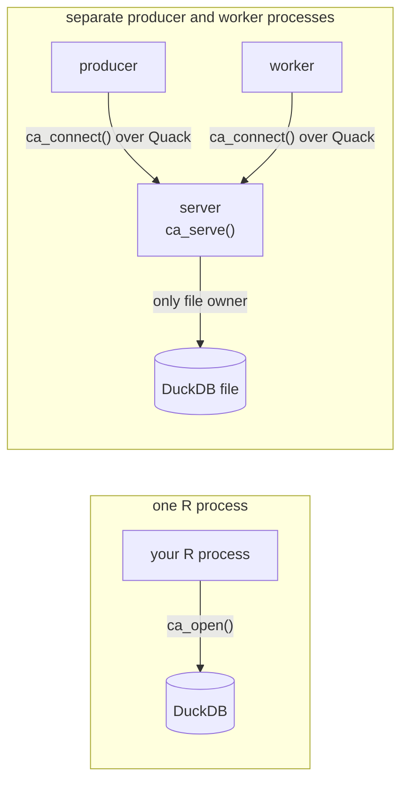
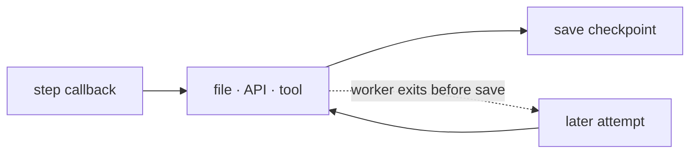
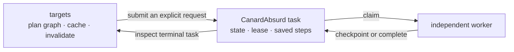

<!-- README.md is generated from README.Rmd. Edit README.Rmd. -->

# CanardAbsurd 

[](https://github.com/RGenomicsETL/CanardAbsurd/actions/workflows/pkgdown.yaml)
[](https://rgenomicsetl.r-universe.dev/CanardAbsurd)

CanardAbsurd keeps costly R work alive after the process that requested it has
returned. An application or API submits a request, a worker pulls it when
capacity is available, and named completed stages are replayed when a later
worker resumes the work.

It adapts the checkpoint-and-replay execution model from
[Absurd](https://github.com/earendil-works/absurd) to R, DuckDB, and Quack.
The R API, SQL state machine, storage layout, and transport are independent.

## Is this the right tool?

Use CanardAbsurd when an input should start expensive work that may outlive its
request process: an upload, a refresh, a report request, or an API call. It is
useful when a replacement worker should continue from saved stages instead of
starting the whole handler again.

It is not a dependency-graph scheduler, an artifact store, a notification
service, or an exactly-once external-effect system. The application decides
when work is requested and what its result means. `targets` can decide graph
expansion, cache validity, and invalidation; CanardAbsurd can run durable
requests that a controller submits.

## The mental model



A workflow is worker code: a named R handler and its `ca_step()` calls. Each
request creates one durable task for that workflow. A task records values for
its named steps in DuckDB; a later attempt replays a saved step instead of
rerunning its callback. DuckDB holds the task state, lease, result, and saved
step values. Terminal tasks are `completed`, `failed`, or `cancelled`.

## Install

```r
install.packages("CanardAbsurd", repos = "https://rgenomicsetl.r-universe.dev")
```

For one R process, use `ca_open()`. For a database shared by producers and
workers, explicitly install the matching Quack extension and run one
long-lived `ca_serve()` process. The [Quack server guide](https://rgenomicsetl.github.io/CanardAbsurd/articles/quack-server.html)
shows the setup.

## Run a small workflow

This local example has one request, two durable stages, and one worker. It is a
good way to learn the handler contract; it is not a shared deployment.

```{r small-workflow}
library(CanardAbsurd)

db <- ca_open()

total <- function(input, task) {
  subtotal <- ca_step(task, "subtotal", function() sum(input$amounts))
  ca_step(task, "total", function() subtotal * (1 + input$tax))
}

id <- ca_spawn(
  db,
  "total",
  list(amounts = c(20, 10), tax = 0.2),
  id = "invoice-42"
)
ca_work(db, list(total = total), max_tasks = 1)

task <- ca_inspect(db, id)
list(state = task$state, attempts = task$attempt,
     checkpoints = names(task$checkpoints), result = task$result)

ca_close(db)
```

If the worker fails after saving `subtotal`, another attempt calls the same
handler and `ca_step(task, "subtotal", ...)` returns the saved value without
running that callback again. A step callback that finishes but fails before its
value is saved can run again.

## Choose where the database lives



Use `ca_open()` when one R process does everything. Otherwise, the server alone
opens the DuckDB file; producers and workers connect through Quack. Handlers run
in workers, not in the server.

## Where repeat work can happen



The checkpoint does not make an external action transactional. Use an
idempotency key where that external system enforces one. A lease rejects stale
writes; it does not stop a process already running. Heartbeat long callbacks.

## Use it with `targets`



`targets` decides whether graph work should run; CanardAbsurd executes the
request that a controller submits. Use an ID for the requested execution, not
only its input value: unchanged inputs can still need another run. There is no
`targets` backend in this package.

## Values and next steps

Inputs, results, and checkpoints use native DuckDB values with R type
descriptors. Supported vectors, lists, data frames, dates, timestamps, factors,
raw vectors, and `integer64` values round trip with their documented mappings.
For other R objects, serialize explicitly to a raw vector and store it as a
BLOB; CanardAbsurd never selects a serializer automatically.

Read the guide that matches the next question:

- [Getting started](https://rgenomicsetl.github.io/CanardAbsurd/articles/getting-started.html): handler, attempt, step, and worker behavior.
- [A Quack server and R workers](https://rgenomicsetl.github.io/CanardAbsurd/articles/quack-server.html): one writable DuckDB owner and separate processes.
- [Durability and recovery](https://rgenomicsetl.github.io/CanardAbsurd/articles/durability.html): leases, retries, failures, sleeps, cancellation, and external effects.
- [Native values and DuckDB R compatibility](https://rgenomicsetl.github.io/CanardAbsurd/articles/native-values.html): mappings and driver limitations.
- [Serialized R values](https://rgenomicsetl.github.io/CanardAbsurd/articles/serialized-values.html): explicit base R, qs2, and Sakura BLOB workflows.
