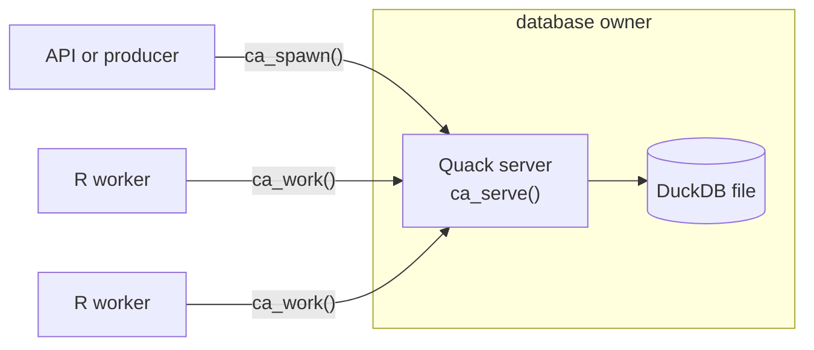

<!-- README.md is generated from README.Rmd. Edit README.Rmd. -->

# CanardAbsurd 

[](https://lifecycle.r-lib.org/articles/stages.html#experimental)
[](https://github.com/RGenomicsETL/CanardAbsurd/actions/workflows/R-CMD-check.yaml)
[](https://github.com/RGenomicsETL/CanardAbsurd/actions/workflows/pkgdown.yaml)
[](https://rgenomicsetl.r-universe.dev/CanardAbsurd)

CanardAbsurd runs expensive R work that must outlive the request that
started it. Submit a task, let any worker pick it up, and if that worker
dies, the next one resumes from the last saved step instead of starting
over.

It brings the checkpoint-and-replay model of
[Absurd](https://github.com/earendil-works/absurd) to R, with DuckDB
holding the state and [Quack](https://github.com/duckdb/duckdb-quack)
giving other processes access to it.

The package is experimental and has no users outside itself. The API,
the SQL schema and the stored format all change without deprecation
cycles or migrations, in favour of a clearer model.

## Install

``` r
install.packages("CanardAbsurd", repos = "https://rgenomicsetl.r-universe.dev")
```

## Example

``` r
library(CanardAbsurd)
db <- ca_open()

total <- function(input, task) {
  subtotal <- ca_step(task, "subtotal", function() sum(input$amounts))
  ca_step(task, "total", function() subtotal * (1 + input$tax))
}

id <- ca_spawn(db, "total", list(amounts = c(20, 10), tax = 0.2), id = "invoice-42")
ca_work(db, list(total = total), max_tasks = 1)
ca_result(db, id)
#> [1] 36
ca_close(db)
```

A **task** is one durable request. Its **handler** is the R function
that runs it, and each `ca_step()` is a named **checkpoint**. If a
worker dies after `subtotal` is saved, the next attempt replays
`subtotal` and computes only `total`.

## How it fits together



- One process owns the DuckDB file with `ca_serve()`. Producers and
  workers reach it over Quack with `ca_connect()`. A single R process
  can use `ca_open()` instead.
- Workers claim tasks under a lease. A worker that loses its lease can
  no longer write, and another worker takes over.
- Handlers run in workers, never in the server.

## Guarantees

- **At least once.** A step whose callback finished but whose result was
  not yet saved runs again. Give external side effects, such as
  payments, emails and uploads, an idempotency key.
- **Leases fence the database, not the world.** A stale worker cannot
  write task state but may still be running. `ca_process()` supervises
  long external commands: it keeps the lease alive while they run and
  kills them when the lease is lost.
- **Not a scheduler.** There is no dependency graph or artifact store.
  Your application or `targets` decides what to run; CanardAbsurd makes
  each submitted run survive crashes.

Inputs, results and checkpoints are native DuckDB values you can query
in SQL: vectors, lists, data frames, dates, timestamps, factors, raw
vectors and `integer64`. Serialize anything else to a raw vector
yourself.

## Guides

- [Getting
  started](https://rgenomicsetl.github.io/CanardAbsurd/articles/getting-started.html):
  handlers, steps, retries and sleeps.
- [A Quack server and R
  workers](https://rgenomicsetl.github.io/CanardAbsurd/articles/quack-server.html):
  deploying across processes.
- [Durability and
  recovery](https://rgenomicsetl.github.io/CanardAbsurd/articles/durability.html):
  leases, failures, long jobs and native maintenance.
- [Native
  values](https://rgenomicsetl.github.io/CanardAbsurd/articles/native-values.html):
  type mappings and DuckDB driver caveats.
- [Serialized R
  objects](https://rgenomicsetl.github.io/CanardAbsurd/articles/serialized-values.html):
  base R, qs2 and Sakura.
