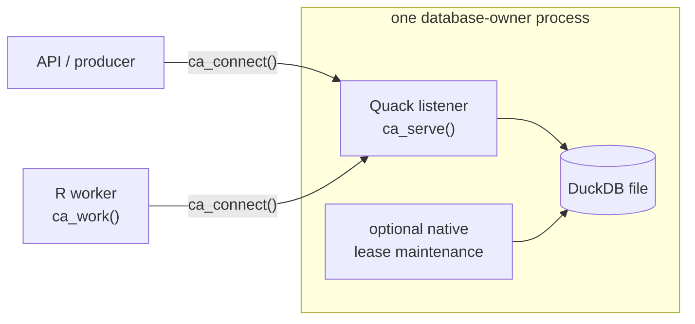

```{r setup, include=FALSE}
knitr::opts_chunk$set(eval = TRUE, cache = FALSE, collapse = TRUE,
                    comment = "#>", error = FALSE, message = FALSE)
```

Quack is required for a shared workflow database. One server process owns the
writable DuckDB file; producers and workers use their own
in-memory DuckDB connections to send SQL through Quack. They must not open the
server's database file directly: multi-process file access causes DuckDB/WAL
contention and locking errors. R handlers execute in those clients, never in a
server callback.

This article starts a temporary server and executes a worker over Quack. It
puts both handles in one R process so the evaluated guide does not need to start
a separate shell process; the connections still communicate through a Quack
endpoint. Production deployment separates the server and
workers as described below. This network-dependent article is built by pkgdown,
while the package vignettes run offline.



## Install the runtime

Install DuckDB's Quack extension explicitly before serving or connecting, and
its `httpfs` dependency, which Quack clients load. From a source checkout,
`make quack` performs this setup. In another R environment, run this once with
network access:

```r
dir.create(path.expand("~/.duckdb"), recursive = TRUE, showWarnings = FALSE)
local({
  con <- DBI::dbConnect(duckdb::duckdb(shared_home = TRUE))
  on.exit(DBI::dbDisconnect(con, shutdown = TRUE))
  DBI::dbExecute(con, "INSTALL quack")
  DBI::dbExecute(con, "INSTALL httpfs")
})
```

The extensions are stored in DuckDB's shared extension directory so later R
processes using the same DuckDB runtime can load them. Package loading and
connections never download extensions.

## Optional maintenance belongs on the owner

The `canard_coordinator` extension is separate from Quack. If it is available in
the deployment, start it explicitly with `ca_coordinator_start()` on the owner
handle returned by `ca_serve()`. A `ca_connect()` client is not its lifecycle
owner. The ordinary server/worker path below does not require the extension.

The native loop marks expired, exhausted attempts failed across all queues, even
when no worker is polling them. It neither runs R handlers nor monitors external
tools or downstream dependencies. Inspect progress and errors with
`ca_coordinator_status()`. Stop it before database teardown;
`ca_close()` does so for a coordinator started through that handle. Stopping is
one-shot: a fresh database instance is required to start another loop.

See [durability and recovery](durability.html#native-lease-maintenance) for the
maintenance contract and [extension instructions](https://github.com/RGenomicsETL/CanardAbsurd/tree/main/tools/canard-coordinator)
for building and signing. Installing Quack does not install this extension.

## Run the server/client path

The demonstration uses a disposable localhost token. Use a securely supplied
nonempty token and a controlled network address for a deployment. Here `path`
is a temporary database file and `uri` is an available localhost endpoint.

```{r server}
library(CanardAbsurd)
path <- tempfile(fileext = ".duckdb")
withr::defer(unlink(c(path, paste0(path, ".wal"))))
uri <- sprintf("quack:127.0.0.1:%d", parallelly::freePort())
server <- ca_serve(path, uri, token = "article-local-only")
withr::defer(ca_close(server))
```

```{r client}
worker <- ca_connect(uri, token = "article-local-only")
withr::defer(ca_close(worker))
```

```{r server-worker}
sum_values <- function(input, ctx) {
  ca_step(ctx, "sum", function() sum(unlist(input$values)))
}
id <- ca_spawn(worker, "sum", list(values = list(10, 20, 12)),
               id = "remote-sum-001", queue = "reports")
ca_work(worker, list(sum = sum_values), queue = "reports", max_tasks = 1)
task <- ca_inspect(worker, id)
list(runtime = ca_runtime(worker), state = task$state, result = task$result)
```

These are independent database connections in one R process, communicating
through a Quack endpoint. The `tinytest` suite also executes workers in
independent R processes and kills worker and database-host processes to test
recovery.

## Deploy across processes

Use the same `ca_serve()` call in a long-lived server R process, with a persistent
database path. It is the only process that opens that file and it must remain
alive to serve requests. Every producer and worker calls `ca_connect()` with the
endpoint and token; workers register their handler lists and enter `ca_work()`.

Each worker executes one attempt at a time. `lease_seconds` must cover the time
between named checkpoint calls or explicit heartbeats. `poll_seconds` controls idle
polling, and `idle_timeout` controls when an idle worker returns. A worker that
only knows one handler will not claim other task names.

Workers that poll together select the same eligible row, and DuckDB aborts the
losing statement with a write conflict. `ca_work()` repeats such a statement up
to `conflict_retries` times (8 by default) with jittered backoff; the retry
repeats only that SQL statement, not the R handler or its external effects, and
does not consume the task's failure budget. Set `conflict_retries = 0` to supply
your own `canard_retryable` policy, as producers calling `ca_spawn()` directly
must. Storage errors include the operation, total attempts,
elapsed seconds, and the original DBI condition. Transport failures propagate
even when raised by a step inside a handler and offer no retry restart.
Released drivers require a message-based compatibility adapter for conflict
classification. The condition's `message_based` field discloses that path; see
[error metadata compatibility](durability.html#error-metadata-compatibility)
for its limits and the upstream reports.

## Inspect and stop

`ca_inspect()` reports state, attempts, failures, available time, owner, and lease
deadline. `ca_runtime()` reports the executing server's versions. `ca_close()`
closes a client; closing the server handle stops its endpoint and closes the file.

```{r close}
ca_close(worker)
ca_close(server)
```

Keep handles process-local. Give package operations their dedicated connections
rather than wrapping them in externally managed transactions.

## Protect the endpoint

The token grants arbitrary SQL, not access to particular task operations. SQL
can read and write files and load extensions with the server process's
operating-system privileges, and a token holder can rewrite any task row without
a lease. Treat every token holder as trusted: the lease protocol fences workers
that follow it, not adversarial ones. A trusted application service can hold the
token and translate authorized requests into fixed operations; browsers and
untrusted computation must never receive it or choose the SQL. Use network
restrictions and TLS at authenticated ingress for non-local deployments. Do not
expose an unprotected Quack server to the internet. Package loading and
connections never install extensions; extension acquisition is explicit setup.
