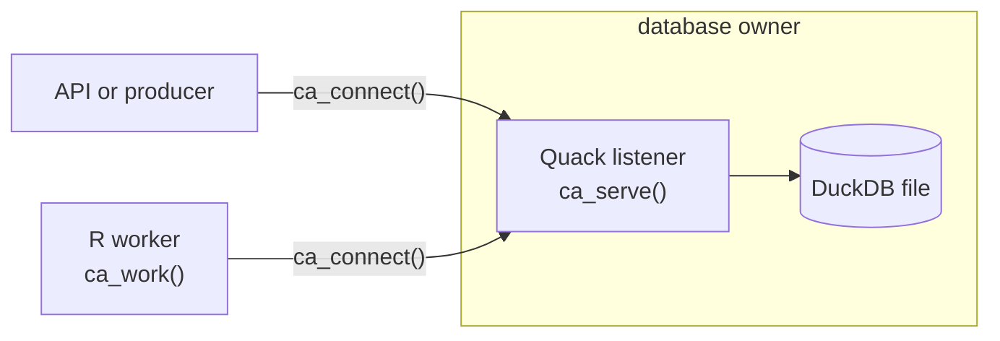

```{r setup, include=FALSE}
knitr::opts_chunk$set(eval = TRUE, cache = FALSE, collapse = TRUE,
                    comment = "#>", error = FALSE, message = FALSE)
```

To share a workflow database, one process owns the DuckDB file and serves it
with `ca_serve()`. Producers and workers connect over Quack with
`ca_connect()`. They must never open the file themselves, because DuckDB allows
only one writing process. Handlers run in the workers, never in the server.



## Install Quack

Connections never download extensions, so install Quack, and the `httpfs`
extension its clients load, once with network access. From a source checkout,
`make quack` does this. Elsewhere, run:

```r
dir.create(path.expand("~/.duckdb"), recursive = TRUE, showWarnings = FALSE)
local({
  con <- DBI::dbConnect(duckdb::duckdb(shared_home = TRUE))
  on.exit(DBI::dbDisconnect(con, shutdown = TRUE))
  DBI::dbExecute(con, "INSTALL quack")
  DBI::dbExecute(con, "INSTALL httpfs")
})
```

Both are stored in DuckDB's shared extension directory, where later R processes
using the same DuckDB version find them.

## Serve and work

This example keeps the server and the worker in one R process so it can run as
a single document. They still talk to each other through a real Quack endpoint.

```{r server}
library(CanardAbsurd)
path <- tempfile(fileext = ".duckdb")
withr::defer(unlink(c(path, paste0(path, ".wal"))))
uri <- sprintf("quack:127.0.0.1:%d", parallelly::freePort())
server <- ca_serve(path, uri, token = "article-local-only")
withr::defer(ca_close(server))
```

```{r client}
worker <- ca_connect(uri, token = "article-local-only")
withr::defer(ca_close(worker))
```

```{r server-worker}
sum_values <- function(input, ctx) {
  ca_step(ctx, "sum", function() sum(unlist(input$values)))
}
id <- ca_spawn(worker, "sum", list(values = list(10, 20, 12)),
               id = "remote-sum-001", queue = "reports")
ca_work(worker, list(sum = sum_values), queue = "reports", max_tasks = 1)
list(runtime = ca_runtime(worker), result = ca_result(worker, id))
```

```{r close}
ca_close(worker)
ca_close(server)
```

## Deploy

- Run `ca_serve()` in a long-lived process with a persistent path. It must stay
  up for the others to work.
- Start as many workers as you have capacity for. Each calls `ca_connect()`,
  then `ca_work()` with its handlers, and runs one attempt at a time.
- Set `lease_seconds` longer than the gap between checkpoints, or supervise
  long commands with `ca_process()`.
- Competing workers retry write conflicts on their own. Producers calling
  `ca_spawn()` outside a worker should handle `canard_retryable`; see
  `?ca_conditions`.
- Keep handles in the process that created them, and do not wrap package calls
  in your own transactions.
- For maintenance of abandoned tasks across all queues, start the optional
  native coordinator on the server handle; see
  [Durability and recovery](durability.html#abandoned-tasks-and-native-maintenance).

## Protect the endpoint

The token grants arbitrary SQL, not a set of task operations. Its holder can
read and write files and load extensions with the server's operating-system
privileges, and can rewrite any task without a lease. Give it only to trusted
workers and services. A trusted application service can hold it and expose
fixed operations to everyone else; browsers and untrusted code must never see
it. Put non-local servers behind authenticated, TLS-terminating ingress, and
never expose Quack directly to the internet.
