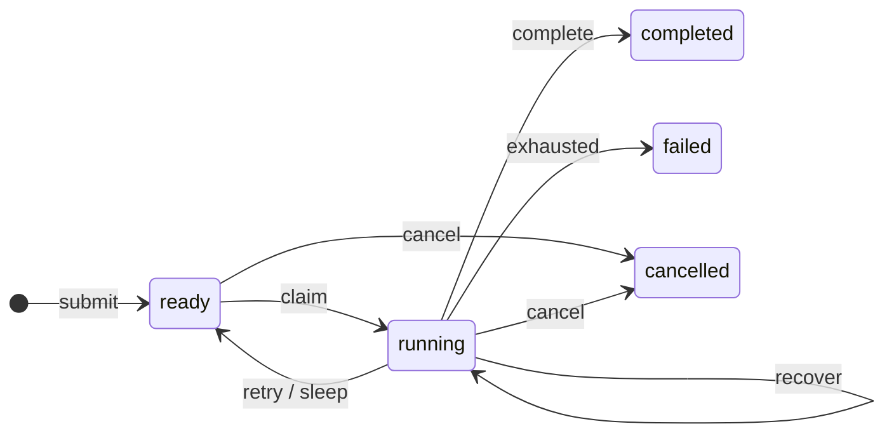
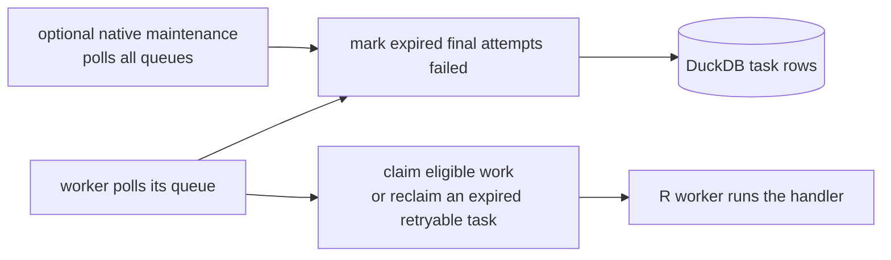

```{r setup, include=FALSE}
knitr::opts_chunk$set(eval = TRUE, cache = FALSE, collapse = TRUE,
                    comment = "#>", error = FALSE, message = FALSE)
```

## What survives and what does not

[Getting started](getting-started.html#the-concepts) defines a task, handler,
attempt, step, checkpoint, and lease. This guide describes what those concepts
mean when a worker, process, or connection fails.

CanardAbsurd provides at-least-once task execution with durable named
checkpoints. A task input, state, lease, counters, and completed step values
survive a worker failure. A replacement worker resumes the handler and replays
those completed steps. Completed, failed, and cancelled tasks are terminal.

This is not exactly-once execution of external effects. A worker can call an
external service and fail before its step result is saved; a later attempt then
calls that service again. Use an application-level idempotency key for every
external mutation.

For a shared workflow database, run one Quack server process as the writable
DuckDB owner. Producers and workers connect through Quack rather than opening
the database file themselves, avoiding direct multi-process DuckDB/WAL locking
and errors.

## Run the examples

The examples use `ca_open()` only to inspect the state machine without a network
or Quack installation. This in-memory database belongs to this one R process;
it is not a shared deployment.

```{r open}
library(CanardAbsurd)
db <- ca_open()
withr::defer(ca_close(db))
```

## How task state changes



Each state transition is one server-side SQL statement; the R handler never
runs inside its transaction. A network failure does not prove that a request was
never executed. Callers can handle `canard_retryable` and invoke its
`canard_retry` restart to repeat a known aborted write conflict. Without that
explicit decision, the error propagates.

Recovery replaces an expired lease when the failure budget allows another
attempt. The `attempt` counter counts claims, including sleep resumptions. The
`failures` counter counts reported failures and expired leases. `max_failures`
is the threshold for terminal failure. Before claiming, `ca_claim()` and
`ca_work()` mark a bounded batch of expired, exhausted tasks as failed in their
selected queue. `reap_limit` defaults to 64. An expired task with failure budget
remaining can instead be reclaimed by a worker; expiry does not by itself start
another attempt.

## Native lease maintenance

A queue with no polling workers still needs cleanup when its final attempt
expires. The optional `canard_coordinator` extension performs that cleanup across
all queues, on a dedicated connection and native thread in the database-owner
process. It increments the failure count, records `Lease expired`, clears the
worker/token/deadline, and marks an exhausted task failed in one SQL statement.



Use `ca_coordinator_start()` on the `ca_open()` or `ca_serve()` owner handle, not
a remote `ca_connect()` client. `poll_milliseconds` sets the maintenance interval;
`reap_limit` bounds the tasks changed by each poll, not the amount of table data
DuckDB may scan. The native loop does not replace worker polling and does not
renew a worker's lease, run a handler, enforce CPU/memory admission, or decide
which downstream tasks are ready.

`ca_coordinator_status()` reports state, poll/reaped/error counters, and the last
error. Starting the loop is not proof that maintenance SQL succeeds; inspect
those counters and errors. `ca_coordinator_stop()` joins the thread and releases
its connection. `ca_close()` does this automatically when the handle started the
coordinator. The instance is one-shot: after stop, use a fresh database instance
to start another coordinator.

The extension is built separately against the stable DuckDB C extension API.
Loading and starting it are explicit; opening an ordinary database does neither.
See the [extension instructions](https://github.com/RGenomicsETL/CanardAbsurd/tree/main/tools/canard-coordinator)
for build, signing, and executable native integration tests.

## A replaced claim cannot write

Failure releases the original claim. A subsequent claim receives a new token;
completion with the old token is rejected without changing the current task.

These examples share a local database opened with `ca_open()`.

```{r fencing}
id <- ca_spawn(db, "example", id = "lease-example")
old <- ca_claim(db)
ca_fail(old, "retry")
current <- ca_claim(db)

outcome <- tryCatch({
  ca_complete(old, "stale")
  "accepted"
}, canard_lease_lost = function(e) "rejected")
ca_complete(current, "current")
task <- ca_inspect(db, id)
list(stale_completion = outcome, result = task$result)
```

Heartbeats, checkpoints, completion, failure, and suspension all require the
current unexpired token. An expired lease cannot be revived by heartbeating.
Cancellation also invalidates subsequent worker writes; it does not interrupt
an external operation already in progress.

## Checkpoints preserve native values

Vectors, lists, data frames, dates, timestamps and other supported R values
retain their declared mappings on execution and replay. A saved `NULL` is
distinct from a missing checkpoint. See [Native values and DuckDB R compatibility](native-values.html)
for the supported classes, precision limits and driver compatibility details.

```{r null-checkpoint}
id <- ca_spawn(db, "example")
first <- ca_claim(db)
ca_step(first, "nullable", function() NULL)
ca_fail(first, "retry")
second <- ca_claim(db)
value <- ca_step(second, "nullable", function() stop("must replay"))
ca_complete(second, value)
list(replayed_null = is.null(value), state = ca_inspect(db, id)$state)
```

Step names must be unique within an attempt. Include a stable index for loop
steps. Treat step names and result shapes as persistent interfaces when deploying
new handler code.

## Query workflow state with SQL

Task state, queue, attempts, failures, and timestamps are typed columns. Inputs
and results are native VARIANT values with separate R type descriptors.
Checkpoint names, kinds and native values are available through
`canard_absurd.task_checkpoints`.

```{r sql-inspection}
DBI::dbGetQuery(db@con, "
  SELECT state, count(*) AS tasks
  FROM canard_absurd.tasks
  GROUP BY state
  ORDER BY state
")
DBI::dbGetQuery(db@con, "
  SELECT name, kind, variant_typeof(value) AS value_type
  FROM canard_absurd.task_checkpoints
  WHERE task_id = ?
", params = list(id))
```

These queries need no DuckDB extensions. Nested fields can be extracted and cast
with native SQL. On affected engines, materialize whole values before indexed
field extraction; the compatibility guide includes the query form and an
executable explanation of the separate nested-NULL conversion issue.

## Inspect an attempt's failure

A handler failure and a task's terminal failure are different events. `ca_run()`
returns both the attempt status and the persisted task state, along with the
original R condition. Persistence errors and interrupts propagate instead of
being recorded as handler failures.

```{r handler-failure}
id <- ca_spawn(db, "example", max_failures = 1)
outcome <- ca_run(ca_claim(db), function(input, ctx) stop("delivery unavailable"))
list(status = outcome$status, state = outcome$state,
     error = conditionMessage(outcome$error))
```

If saving a handler failure also fails, `canard_failure_recording_error` retains
the handler condition in `parent` and the storage condition in
`persistence_error`. Error text is stored without truncation. Rich R conditions
remain in attempt outcomes; the database stores their messages, not serialized R
objects. See `?ca_conditions` for the condition fields and retry notifications.

## Error metadata compatibility

Error preservation depends on the installed R driver and Quack build. Affected
R wrappers discard the original condition's fields and cause chain; affected
Quack bind paths turn the transported structured error into an
`InvalidInputException`.

The R wrapper report is [duckdb-r #2711](https://github.com/duckdb/duckdb-r/issues/2711).
The fixes in [duckdb-r #2714](https://github.com/duckdb/duckdb-r/pull/2714) and
[duckdb-quack #212](https://github.com/duckdb/duckdb-quack/pull/212) are merged.
Their merge status alone does not establish that an installed driver/extension
pair includes both fixes.

CanardAbsurd first uses a structured DuckDB transaction error when available.
Otherwise, one compatibility adapter recognizes exact tested write-conflict
messages and duplicate-key messages containing the submitted task ID. It does
not search arbitrary diagnostic text for conflict fragments. A
`canard_conflict` or `canard_retryable` condition has `message_based = TRUE` when
that adapter supplied the classification, and `FALSE` when structured metadata
supplied it. Structured non-transaction types take precedence over the text.

This is a workaround for released drivers, **not a stable error protocol**.
Changed or unknown message forms propagate without a retry restart, as do
transport failures. An unhandled recognized conflict also propagates: retry
limits and delays still belong to the caller. Revalidate the DuckDB/Quack pair
when upgrading; the integration suite uses installed packages and independent
R processes. The package requires DuckDB R 1.5.5 or newer. Historical probes on
1.5.3 explain the compatibility adapter, but that version is not a supported
package runtime.

## External effects still need idempotency

A worker can call an external service, crash before saving the result, and repeat
that call on recovery. Checkpointing does not make an HTTP request transactional
with DuckDB. Use a stable business-level idempotency key for payments, messages,
and other mutations. Deduplicating task submission does not deduplicate those
external effects.

Long operations must call `ca_heartbeat(ctx)` before their lease expires. Calls
to `ca_step()` and `ca_sleep()` renew leases, but no background R thread renews
a lease while a callback blocks.

## Operational limits

- Checkpoints share the task row so lease changes and checkpoint writes contend
  on the same durable record. This keeps lease ownership and checkpoint storage
  in one update; it is not a throughput guarantee.
- Inputs, results, checkpoints and error text have no package-imposed byte quota.
  Large values still consume engine memory, disk and transport capacity.
- Claims and checkpoint replay use a fenced typed read after their lease UPDATE.
  A failure of that read does not undo the UPDATE or cause a handler to run.
  See the compatibility guide for the additional round trip and recovery rules.
- Schema version 1 bounds task IDs and handler names to 256 characters, queue
  names to 128 characters, and failure budgets to 1 through 1,000,000. Changing
  those persisted constraints requires a schema change, not a client option.
- Task IDs remain deduplicated while their rows are retained. Retention and
  database growth are operator responsibilities.
- Schema version 1 is checked at open/connect time. Events, cron, automatic
  retention, history tables, and schema migrations are outside this release.
- Quack is experimental. Record `ca_runtime()` when validating a deployment;
  compatibility depends on the DuckDB and Quack versions in deployment.

## Close the example database

```{r close}
ca_close(db)
```
