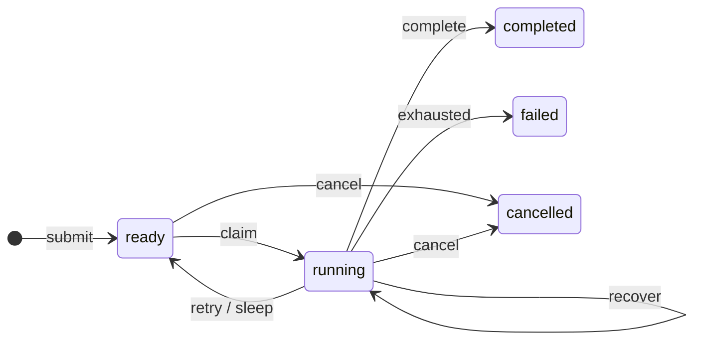

```{r setup, include=FALSE}
knitr::opts_chunk$set(eval = TRUE, cache = FALSE, collapse = TRUE,
                    comment = "#>", error = FALSE, message = FALSE)
```

CanardAbsurd runs tasks **at least once** and saves named checkpoints. When a
worker, process or connection fails:

- the task's input, state, counters and saved steps survive;
- a replacement worker reruns the handler, replaying saved steps;
- a step whose callback finished but whose result was not saved runs again.

Checkpointing does not make an HTTP call or a file write transactional, so give
every external side effect an idempotency key.

```{r open}
library(CanardAbsurd)
db <- ca_open()
withr::defer(ca_close(db))
```

## Task states



`completed`, `failed` and `cancelled` are terminal. Each transition is one SQL
statement, and no handler code runs inside a transaction.

## Leases fence stale workers

A claim carries a lease token. Every write from a worker, whether a heartbeat,
checkpoint, sleep, completion or failure, needs the current token and an
unexpired lease. A worker that has lost its claim therefore cannot overwrite the
task.

```{r fencing}
id <- ca_spawn(db, "example", id = "lease-example")
old <- ca_claim(db)
ca_fail(old, "retry")
current <- ca_claim(db)

outcome <- tryCatch({
  ca_complete(old, "stale")
  "accepted"
}, canard_lease_lost = function(e) "rejected")
ca_complete(current, "current")
list(stale_completion = outcome, result = ca_result(db, id))
```

An expired lease cannot be renewed, and cancellation invalidates the token.
Neither stops code that is already running; `ca_process()` covers that below.

## Failures and the retry budget

- `attempt` counts claims, including resumptions after a sleep.
- `failures` counts handler failures and expired leases. When it reaches
  `max_failures`, the task becomes `failed`.
- An expired lease with budget left is reclaimed by the next worker that polls.

A handler error is recorded as a failure. `ca_run()` returns both the attempt's
status and the task's new state:

```{r handler-failure}
id <- ca_spawn(db, "example", max_failures = 1)
outcome <- ca_run(ca_claim(db), function(input, ctx) stop("delivery unavailable"))
list(status = outcome$status, state = outcome$state,
     error = conditionMessage(outcome$error))
```

Storage errors, lost leases and interrupts propagate instead. They are not the
handler's fault and do not use the budget. If recording a handler failure itself
fails, `canard_failure_recording_error` keeps both conditions.

Write conflicts are routine when workers compete for the same task. DuckDB
aborts the losing statement, so repeating it is safe: `ca_work()` retries it up
to `conflict_retries` times (8 by default) with jittered backoff, without
rerunning any R code. Outside a worker, handle `canard_retryable` and invoke the
`canard_retry` restart yourself. Network errors are never retried, because the
statement may already have committed. See `?ca_conditions`.

## Supervise work longer than a lease

Only `ca_step()`, `ca_sleep()` and `ca_heartbeat()` renew a lease. A step that
blocks in `system2()` for longer than the lease lets another worker reclaim the
task and start the same work again.

`ca_process()` runs the command in a child process and keeps the lease alive
from the worker. Each attempt gets its own directory, with `stdout.log` and
`stderr.log`, so an abandoned attempt cannot overwrite accepted output. The
command is killed on lease loss, cancellation or timeout. Return output paths
from a `ca_step()` so that only the current lease holder publishes them.

```{r process}
rscript <- file.path(R.home("bin"),
  if (.Platform$OS.type == "windows") "Rscript.exe" else "Rscript")
root <- tempfile("canard-work-")
withr::defer(unlink(root, recursive = TRUE))
align <- function(input, ctx) {
  ca_step(ctx, "align", function() {
    directory <- ca_process(ctx, rscript,
      c("-e", "Sys.sleep(1.5); writeLines('aligned', 'sample.bam')"),
      directory = file.path(root, ctx@id, "align"), heartbeat_seconds = 0.2)
    file.path(directory, "sample.bam")
  })
}
id <- ca_spawn(db, "align", id = "sample-101")
ca_work(db, list(align = align), max_tasks = 1, lease_seconds = 0.5)
task <- ca_tasks(db, id = id)
list(state = task$state, attempts = task$attempt,
     output = basename(dirname(ca_result(db, id))))
```

The command ran three times longer than the lease without being reclaimed. For
Slurm or another scheduler, track the scheduler's own job ID: supervising
`sbatch` does not supervise the job.

## Checkpoints keep R values

A saved `NULL` is a value, distinct from a missing checkpoint:

```{r null-checkpoint}
id <- ca_spawn(db, "example")
first <- ca_claim(db)
ca_step(first, "nullable", function() NULL)
ca_fail(first, "retry")
second <- ca_claim(db)
value <- ca_step(second, "nullable", function() stop("must replay"))
ca_complete(second, value)
list(replayed_null = is.null(value), state = ca_inspect(db, id)$state)
```

Step names must be unique within an attempt and stable across deployments; give
loop iterations an index. [Native values](native-values.html) lists the type
mappings.

## Query state with SQL

Tasks live in `canard_absurd.tasks`, and the `canard_absurd.task_checkpoints`
view lists their checkpoints.

```{r sql-inspection}
DBI::dbGetQuery(db@con, "
  SELECT state, count(*) AS tasks
  FROM canard_absurd.tasks
  GROUP BY state
  ORDER BY state
")
DBI::dbGetQuery(db@con, "
  SELECT name, kind, variant_typeof(value) AS value_type
  FROM canard_absurd.task_checkpoints
  WHERE task_id = ?
", params = list(id))
```

## Abandoned tasks and native maintenance

When a worker dies during a task's last allowed attempt, the task must still be
marked `failed`. Workers do this for their own queue each time they poll, up to
`reap_limit` tasks at a time.

For queues that no worker polls, the optional `canard_coordinator` extension
does the same across all queues from a native thread in the database owner.
Start it with `ca_coordinator_start()` on the owner handle, check it with
`ca_coordinator_status()`, and stop it with `ca_coordinator_stop()` or
`ca_close()`. Close with `ca_close()`: the extension's connection otherwise
keeps the database locked until the process exits.

The extension is experimental and can start only once per database instance.
No signed build is distributed, so a local build loads only with
`ca_open(allow_unsigned_extensions = TRUE)`, a development setting that lets any
SQL load native code. See the
[build instructions](https://github.com/RGenomicsETL/CanardAbsurd/tree/main/tools/canard-coordinator).

## Error classification

Released DuckDB R and Quack builds lose the structured type of some errors
([duckdb-r #2711](https://github.com/duckdb/duckdb-r/issues/2711),
[duckdb-quack #212](https://github.com/duckdb/duckdb-quack/pull/212)). Until the
installed versions carry both fixes, CanardAbsurd recognizes write conflicts by
their exact, tested message text and sets `message_based = TRUE` when it does.
Unknown messages are never treated as retryable. Recheck this when you upgrade
DuckDB or Quack.

## Limits

- Checkpoints live in the task row, and every new step rewrites that task's
  checkpoint map, so many large checkpoints get slow. Save file references
  rather than bulk data, and measure your workload with
  [`tools/benchmark.R`](https://github.com/RGenomicsETL/CanardAbsurd/blob/main/tools/benchmark.R).
- Values travel as SQL text. There is no byte quota, but engine memory and
  transport limits apply.
- Task IDs and handler names are at most 256 characters and queue names at most
  128; `max_failures` ranges from 1 to 1,000,000.
- Task IDs stay deduplicated for as long as their rows are kept. Retention is up
  to you.
- There are no events, cron schedules, history tables or schema migrations yet.
- Quack is experimental. Record `ca_runtime()` when you validate a deployment.

```{r close}
ca_close(db)
```
