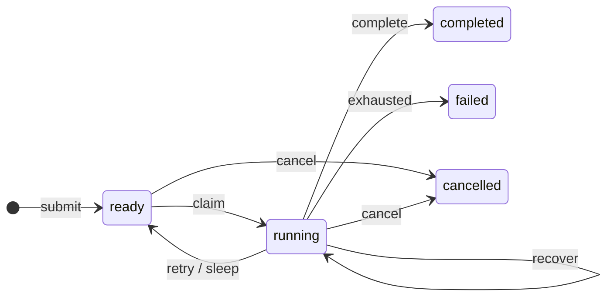

```{r setup, include=FALSE}
knitr::opts_chunk$set(eval = TRUE, cache = FALSE, collapse = TRUE, comment = "#>", error = FALSE)
library(CanardAbsurd)
```

## What is durable?

DuckDB stores each task's inputs, state, lease token, counters, and checkpoint
map. The R handler runs outside a database transaction. Each state transition
is a server-side SQL statement; known aborted write conflicts receive bounded
retries. A network failure does not prove that a request was never executed.



Completed, failed, and cancelled tasks are terminal. Recovery replaces an expired
lease when the failure budget allows another attempt.

The `attempt` counter counts claims, including sleep resumptions. The `failures`
counter counts reported failures and expired leases. `max_failures` is the
threshold for terminal failure. Reaping happens on the claim path, so an expired
last attempt is marked failed when workers next poll its queue.

## A replaced claim cannot write

Failure releases the original claim. A subsequent claim receives a new token;
completion with the old token is rejected without changing the current task.

```{r fencing}
local({
  db <- ca_open()
  on.exit(ca_close(db))
  id <- ca_spawn(db, "example", id = "lease-example")
  old <- ca_claim(db)
  ca_fail(old, "retry")
  current <- ca_claim(db)

  outcome <- tryCatch({
    ca_complete(old, "stale")
    "accepted"
  }, canard_lease_lost = function(e) "rejected")
  ca_complete(current, "current")
  task <- ca_inspect(db, id)
  stopifnot(outcome == "rejected", task$result == "current")
  list(stale_completion = outcome, result = task$result)
})
```

Heartbeats, checkpoints, completion, failure, and suspension all require the
current unexpired token. An expired lease cannot be revived by heartbeating.
Cancellation also invalidates subsequent worker writes; it does not interrupt
an external operation already in progress.

## Checkpoints are JSON values

JSON arrays normalize to R lists on both execution and replay. JSON objects
become named lists. A saved `NULL` is distinct from a missing checkpoint.

```{r null-checkpoint}
local({
  db <- ca_open()
  on.exit(ca_close(db))
  id <- ca_spawn(db, "example")
  first <- ca_claim(db)
  ca_step(first, "nullable", function() NULL)
  ca_fail(first, "retry")
  second <- ca_claim(db)
  value <- ca_step(second, "nullable", function() stop("must replay"))
  ca_complete(second, value)
  stopifnot(is.null(value), ca_inspect(db, id)$state == "completed")
  list(replayed_null = is.null(value), state = ca_inspect(db, id)$state)
})
```

Step names must be unique within an attempt. Include a stable index for loop
steps. Treat step names and result shapes as persistent interfaces when deploying
new handler code.

## External effects still need idempotency

A worker can call an external service, crash before saving the result, and repeat
that call on recovery. Checkpointing does not make an HTTP request transactional
with DuckDB. Use a stable business-level idempotency key for payments, messages,
and other mutations. Deduplicating task submission does not deduplicate those
external effects.

Long operations must call `ca_heartbeat(ctx)` before their lease expires. Step
boundaries renew leases, but no background R thread renews a lease while a
callback blocks.

## Operational boundaries

- Checkpoints share the task row so lease changes and checkpoint writes contend
  on the same durable record. This trades whole-row JSON updates for a simple
  ownership invariant, not a throughput guarantee.
- Individual encoded JSON values are limited to 1 MiB; the checkpoint document
  is limited to 16 MiB.
- Task IDs remain deduplicated while their rows are retained. Retention and
  database growth are operator responsibilities.
- Schema version 1 is checked at open/connect time. Events, cron, automatic
  retention, history tables, and schema migrations are outside this release.
- Quack is experimental. Record `ca_runtime()` when validating a deployment;
  compatibility depends on the actual DuckDB and Quack pair.
