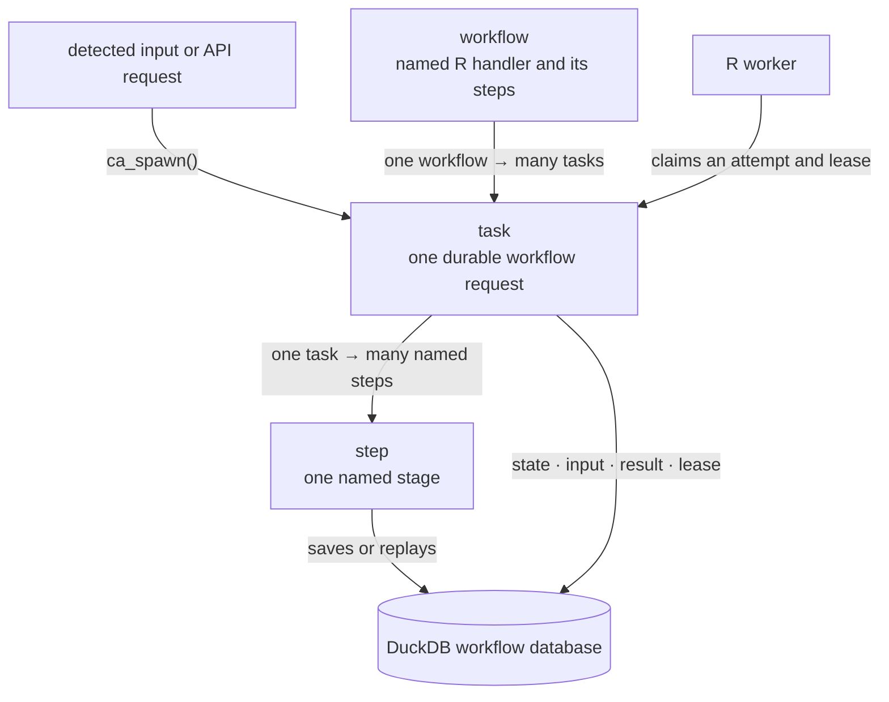
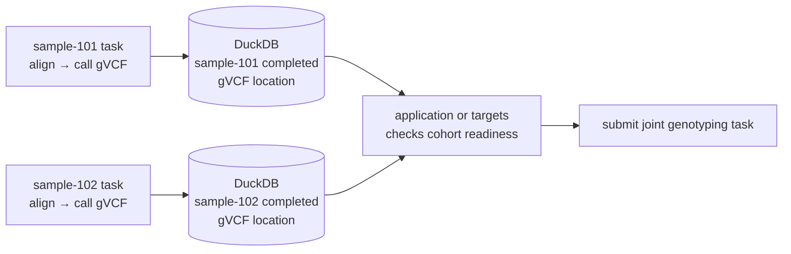

```{r setup, include=FALSE}
knitr::opts_chunk$set(eval = TRUE, cache = FALSE, collapse = TRUE,
                    comment = "#>", error = FALSE, message = FALSE)
```

A workflow is worker code: a named R handler and its named `ca_step()` calls.
One workflow can have many durable task requests. Each task can have many saved
step values.

## The concepts



The workflow code stays in a worker process; DuckDB stores task state, leases,
results, and saved step values. A later attempt replays a saved step instead of
rerunning its callback. A stale or cancelled worker cannot write.

`ca_spawn()` creates a task. `ca_work()` claims tasks for the handler names it
knows, executes attempts, and reports their outcomes. `ca_inspect()` reads the
current task record.

This guide uses an in-memory database to introduce that lifecycle without
network access or a Quack installation. It is a one-process example: no other
R process accesses this database. For a shared workflow database, Quack is
mandatory: one server process owns the writable DuckDB file, and producers and
workers use `ca_connect()` rather than opening that file.

## Submit, work, and inspect one task

```{r open}
library(CanardAbsurd)
db <- ca_open()
withr::defer(ca_close(db))
```

```{r first-task}
total <- function(input, ctx) {
  ca_step(ctx, "calculate", function() input$amount + input$tax)
}

id <- ca_spawn(db, "total", list(amount = 20, tax = 2), id = "order-001")
ca_work(db, list(total = total), max_tasks = 1)
task <- ca_inspect(db, id)
list(state = task$state, result = task$result)
```

The stable ID also makes submission idempotent: submitting the same name, input,
queue, priority, and failure budget under that ID returns the existing task.
Different input under that ID raises `canard_spawn_conflict`. Input equality
includes the R mapping, names, and their order.

## Resume after a failure

The first step below completes once. The second step fails on its first call,
so the worker retries the handler. The saved first step is replayed.

```{r replay}
calls <- c(prepare = 0L, deliver = 0L)
replay <- function(input, ctx) {
  value <- ca_step(ctx, "prepare", function() {
    calls[["prepare"]] <<- calls[["prepare"]] + 1L
    input$value * 2
  })
  ca_step(ctx, "deliver", function() {
    calls[["deliver"]] <<- calls[["deliver"]] + 1L
    if (calls[["deliver"]] == 1L) stop("temporary failure")
    value
  })
}

report <- function(outcome) {
  if (!is.null(outcome$error)) {
    cat("Attempt", outcome$attempt, ":", conditionMessage(outcome$error), "\n")
  }
}
id <- ca_spawn(db, "replay", list(value = 21), id = "replay-001")
ca_work(db, list(replay = replay), idle_timeout = 0, on_result = report)
task <- ca_inspect(db, id)
data.frame(state = task$state, attempts = task$attempt,
           failures = task$failures, prepare_calls = calls[["prepare"]],
           deliver_calls = calls[["deliver"]], result = task$result)
```

`on_result` receives every persisted attempt outcome, including the original
handler condition on failure. Without a callback, the worker warns on failures.
`failure_delay` controls when a failed task becomes eligible again; its default
is zero. The local counters expose which callbacks ran; they are not durable
workflow state. Durable results live in the database.

## Release a task until later

`ca_sleep()` saves its checkpoint and releases the claim. The resumed handler
passes that named sleep without scheduling it again.

```{r sleep}
pause <- function(input, ctx) {
  ca_sleep(ctx, "pause", seconds = 0)
  "resumed"
}
id <- ca_spawn(db, "pause", max_failures = 1)
ca_work(db, list(pause = pause), max_tasks = 2)
task <- ca_inspect(db, id)
list(result = task$result, attempts = task$attempt, failures = task$failures)
```

A zero-second sleep demonstrates the state transition without delaying the
render. Positive durations use the database clock. Sleeps do not consume the
failure budget.

## Several samples, then a cohort

For genomics work, one sample task could have named steps for alignment and gVCF
calling. Two samples are two tasks that separate workers can run concurrently.
Joint genotyping is another task, submitted when the required sample outputs are
ready.



These arrows describe application orchestration, not a dependency API supplied
by CanardAbsurd. Sequential `ca_step()` calls inside one sample handler are not
independently scheduled jobs. A stored gVCF path also does not store the file:
workers need access to the outputs and compatible execution environments.

The optional native coordinator handles expired final attempts. It does not
supply the cohort-readiness check in this diagram. See
[native lease maintenance](durability.html#native-lease-maintenance).

## Choose a worker lifetime

- `max_tasks = 1` executes one claimed attempt, including a failure or suspension.
- `idle_timeout = 0` drains work that is currently eligible.
- The defaults keep polling until the worker is interrupted.

Each worker runs one attempt at a time. For concurrency, run independent R
processes connected to a Quack server. Only names present in `handlers` are
claimed. See the [Quack server guide](https://rgenomicsetl.github.io/CanardAbsurd/articles/quack-server.html).

Close the one-process connection when finished. The deferred cleanup also
closes it if a later example errors.

```{r close}
ca_close(db)
```
