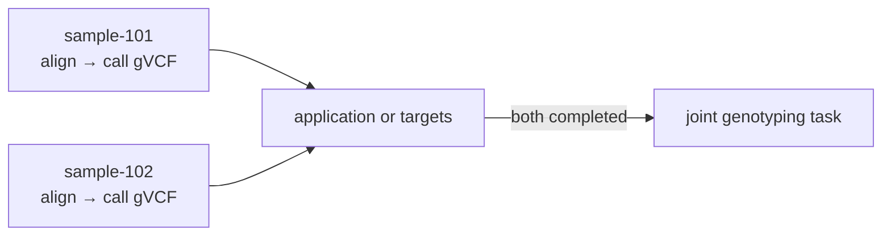

```{r setup, include=FALSE}
knitr::opts_chunk$set(eval = TRUE, cache = FALSE, collapse = TRUE,
                    comment = "#>", error = FALSE, message = FALSE)
```

A handler is an R function of `(input, ctx)`. Wrap each expensive stage in
`ca_step(ctx, "name", fn)`: its result is saved, and a later attempt replays it
instead of calling `fn` again.

This guide uses an in-memory database inside one R process. To run workers in
separate processes, see [A Quack server and R workers](https://rgenomicsetl.github.io/CanardAbsurd/articles/quack-server.html).

```{r open}
library(CanardAbsurd)
db <- ca_open()
withr::defer(ca_close(db))
```

## Run a task

```{r first-task}
total <- function(input, ctx) {
  ca_step(ctx, "calculate", function() input$amount + input$tax)
}

id <- ca_spawn(db, "total", list(amount = 20, tax = 2), id = "order-001")
ca_work(db, list(total = total), max_tasks = 1)
ca_result(db, id)
```

The ID makes submission idempotent. Resubmitting the same request returns the
existing task, and a different request under that ID raises
`canard_spawn_conflict`. Choose your own IDs so a lost response can be retried
safely.

## Resume after a failure

`deliver` fails on its first call. The worker records the failure, retries the
task, and replays `prepare` from its checkpoint.

```{r replay}
calls <- c(prepare = 0L, deliver = 0L)
replay <- function(input, ctx) {
  value <- ca_step(ctx, "prepare", function() {
    calls[["prepare"]] <<- calls[["prepare"]] + 1L
    input$value * 2
  })
  ca_step(ctx, "deliver", function() {
    calls[["deliver"]] <<- calls[["deliver"]] + 1L
    if (calls[["deliver"]] == 1L) stop("temporary failure")
    value
  })
}

report <- function(outcome) {
  if (!is.null(outcome$error)) {
    cat("Attempt", outcome$attempt, ":", conditionMessage(outcome$error), "\n")
  }
}
id <- ca_spawn(db, "replay", list(value = 21), id = "replay-001")
ca_work(db, list(replay = replay), idle_timeout = 0, on_result = report)
task <- ca_inspect(db, id)
data.frame(state = task$state, attempts = task$attempt,
           failures = task$failures, prepare_calls = calls[["prepare"]],
           deliver_calls = calls[["deliver"]], result = task$result)
```

`prepare` ran once and `deliver` twice. `on_result` receives each attempt's
outcome; without it, the worker warns when a handler fails. `max_failures`
(3 by default) bounds retries, and `failure_delay` spaces them out.

## Sleep durably

`ca_sleep()` saves a checkpoint and releases the task until the delay has passed
on the database clock. On resumption the sleep is skipped. Sleeping does not use
the failure budget.

```{r sleep}
pause <- function(input, ctx) {
  ca_sleep(ctx, "pause", seconds = 0)
  "resumed"
}
id <- ca_spawn(db, "pause", max_failures = 1)
ca_work(db, list(pause = pause), max_tasks = 2)
task <- ca_inspect(db, id)
list(result = task$result, attempts = task$attempt, failures = task$failures)
```

## Watch tasks

`ca_tasks()` lists the status of many tasks without loading their data.
`ca_inspect()` returns everything about one task, including its checkpoints.

```{r watch}
ca_tasks(db, state = "completed")[, c("id", "name", "attempt", "failures")]
names(ca_inspect(db, "replay-001")$checkpoints)
```

## Samples, then a cohort

Make one task per sample, with alignment and gVCF calling as its steps, and
separate workers process samples in parallel. Joint genotyping is another task,
which your application or `targets` submits once every sample task has
completed. CanardAbsurd has no dependency API: tasks record where outputs are,
and workers need access to those files.



## Worker lifetime

- `max_tasks = 1` runs one attempt.
- `idle_timeout = 0` drains the eligible work and returns.
- By default a worker polls until it is interrupted.

A worker runs one attempt at a time and claims only tasks whose names appear in
`handlers`. To scale out, run more worker processes connected through Quack.

```{r close}
ca_close(db)
```
